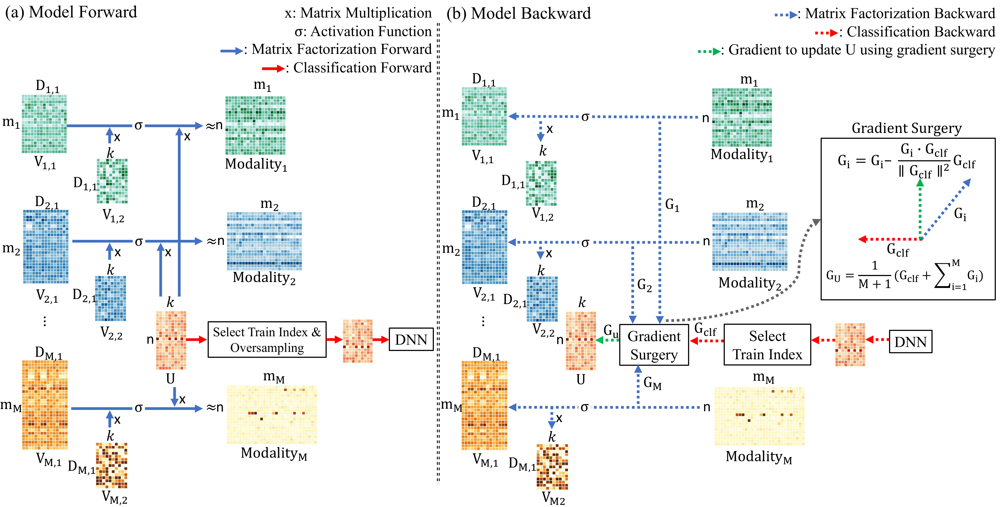

# MMMF: Multimodal Multitask Matrix Factorization for classification and feature selection

MMMF uses **matrix factorization (MF) to integrate data from multiple heterogeneous biological data** and **oversampling is used to resolve imbalanced data** in the training step.
And **gradient surgery that projects a classification gradient onto the normal plane of the gradient of the MF with a conflicting gradient is used for multitask** (MF and classification) learning to increase the quantity of classification information.

### Workflow

### Requirements
- Python: 3.7.3
- Pytorch: 1.7.0
- imblearn: 0.8.1

### Dataset
**The dataset used in the paper was not provided in this repository.**  

| Dataset | Modality |
| --- | --- |
| ADNI | structural magnetic resonance imaging (sMRI), positron emission tomography (PET), gene expression(GE) |
| ROSMAP | gene expression (GE), DNA methylation (ME), microRNA expression(MI) |
| BRCA | gene expression (GE), protein abundance (PROT), copy number variants (CNV) | 
| KIRC | gene expression (GE), DNA methylation (ME), microRNA expression(MI) | 
| Colon | gene expression (GE), DNA methylation (ME), CpGs |

### Classification
- reproduction: Classification.ipynb (Load best model & Check test performance)
- code
    - MMMF.py: Train for MMMF
    - MMMF-Over.py: Train for MMMF with oversampling removed (MMMF-Over)
    - MMMF-GS.py: MMMF with gradient surgery removed (MMMF-GS)
    - MMMF-Over-GS.py: Train for MMMF without oversampling and gradient surgery (MMMF-Over-GS)
- code argument
    - device: GPU Device
    - patience: Early-Stopping patience
    - data_type: Dataset (0: ADNI, 1: ROSMAP, 2: BRCA, 3: KIRC, 4: Colon)
    - mp: Top 1000, 2000, 3000 features with the highest variances from the training dataset of each cross-validation. (0: 1000, 1: 2000, 2: 3000)
    - du_list: Hyper-parameters of dimensions ($[D i2 , D i3 , h]$)
    - re_lr: Learning rate were used for training multiple coefficient matrices ($V_{i,r}$)
    - re_reg: Regularization rate were used for training multiple coefficient matrices ($V_{i,r}$)
    - clf_lr: Learning rate were used for train classifier and a common basis matrix ($U$)
    - clf_reg: Regularization rate were used for train classifier and a common basis matrix ($U$)
    - re_patience: The initial patience for training $U$ using only the $G_{\text{MF}}$ ($T_{\text{p}}$)

**The trained model can be downloaded from https://drive.google.com/drive/folders/1OZipD3tDRYl6dQSlebL4IY4t3h0YPDyh**

### Feature Selection
- reproduction: Feature_Selection.ipynb
- code
    - Feature_Selection.py: Feature Selection & SVM Train
- code argument
    - device: GPU Device
    - data_type: Dataset (0: ADNI, 1: ROSMAP, 2: BRCA, 3: KIRC, 4: Colon)
    - mp: Top 1000, 2000, 3000 features with the highest variances from the training dataset of each cross-validation. (0: 1000, 1: 2000, 2: 3000)
    - top_n: Top n
    - feature_selection: Feature Selection Method (0: MMMF, 1: Random)

**All results of Classification and feature selection (Probability of each class) can be found at the https://drive.google.com/drive/folders/18DsDCMricbMlSzfKIa4lRESwGVZxuOzO**
